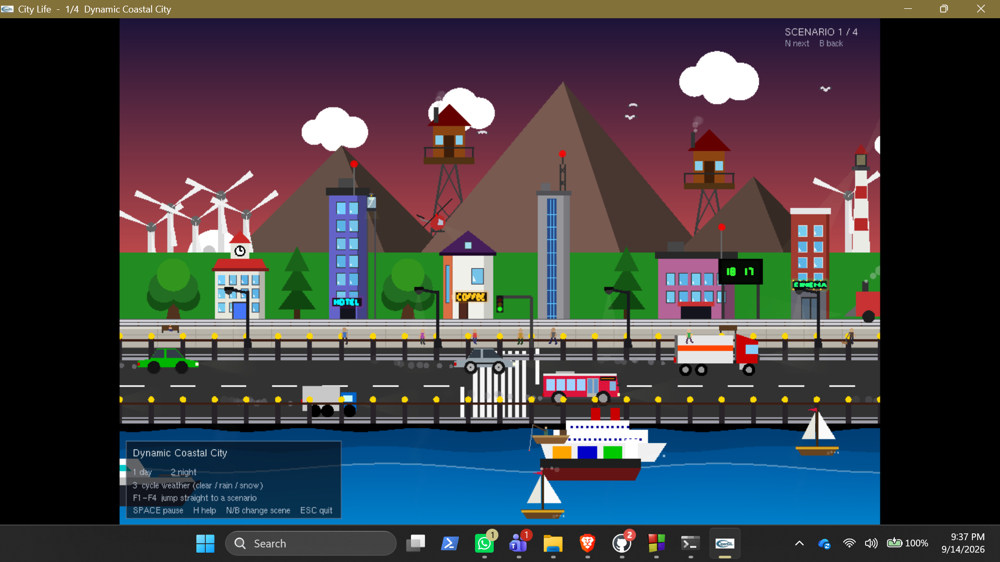
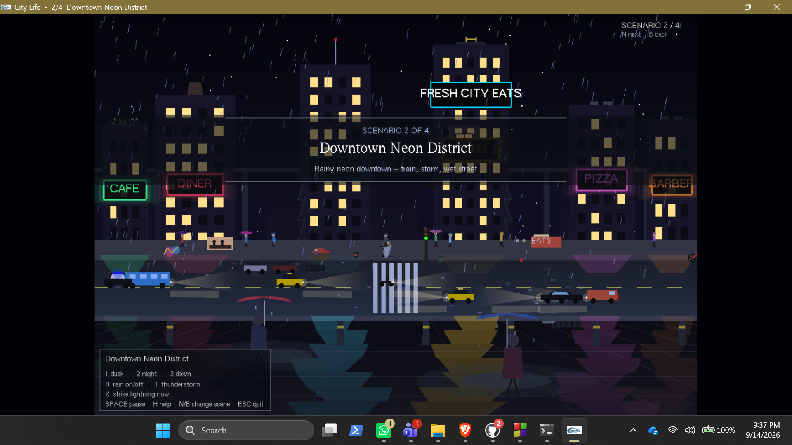
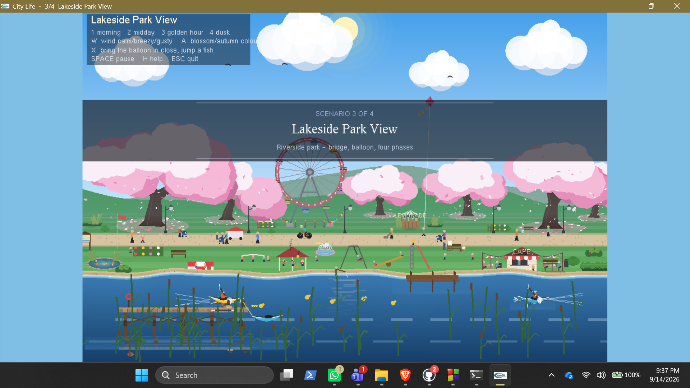
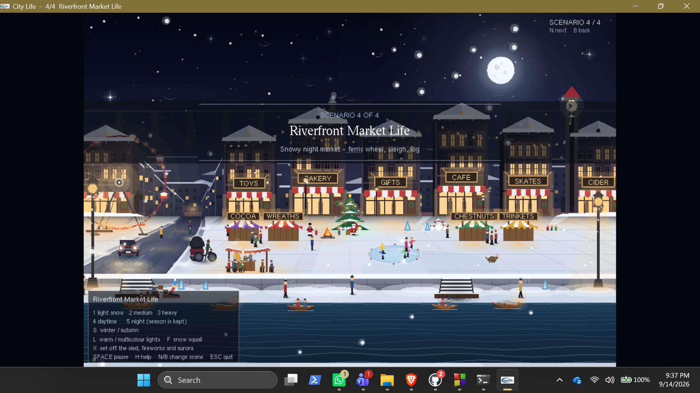

# CityLifeFinalFile

A single-file C++ OpenGL demo that presents four animated city and landscape scenes in one program. Each scenario is built into its own namespace, allowing the app to switch between them smoothly without name collisions.

## Overview

CityLifeFinalFile.cpp creates a self-contained interactive scene viewer with these four environments:

- Dynamic Coastal City
  - day and night lighting
  - storm and weather variation
  - lighthouse and helicopter motion

- Downtown Neon District
  - rainy nighttime city mood
  - glowing signage and wet street reflections
  - elevated train atmosphere

- Riverside Park
  - cherry blossoms and seasonal color shifts
  - ferris wheel, kayaks, and scenic shoreline details
  - multiple time-of-day phases

- Winter Night Market
  - snowy plaza and festive winter ambience
  - river, traffic, and seasonal lighting changes
  - snow squalls and different lighting palettes

The application opens directly on Scenario 1 and lets the user move between scenes using keyboard controls.

## Controls

### Scene navigation

- N or Right Arrow: next scene
- B or Left Arrow: previous scene
- F1-F4: jump directly to a specific scene
- ESC: quit the program

### Global controls

- Space: pause / resume
- H: show / hide the control panel
- X: trigger this scenario's rare event or demo helper

### Scenario-specific controls

- Scenario 1 (Coastal City)
  - 1: day
  - 2: night
  - 3: cycle weather

- Scenario 2 (Downtown)
  - 1: dusk
  - 2: night
  - 3: dawn
  - R: rain
  - T: storm

- Scenario 3 (Riverside Park)
  - 1-4: morning, midday, golden hour, dusk
  - W: wind level
  - A: blossom / autumn color mode

- Scenario 4 (Winter Night Market)
  - 1-3: snow amount
  - 4 or 5: day or night
  - S: season
  - L: light color
  - F: snow squall

## Build and run (Windows)

`CityLifeFinalFile.cpp` includes:

- `windows.h` for the Windows platform
- `GL/gl.h` for the legacy OpenGL 1.x API
- `GL/glut.h` for the GLUT window, input, timer, and bitmap-font APIs
- C++ standard headers only (`cmath`, `cstdlib`, `cstdio`, `cstring`, `ctime`, and `iostream`)

The source does not call any GLU functions, so `glu32` is not a required link library. The required native libraries are:

- **OpenGL32**: the Windows system library, linked as `-lopengl32`
- **FreeGLUT**: the GLUT implementation, providing `GL/glut.h`, `libfreeglut.a` (or an equivalent import library), and `freeglut.dll`

You also need a Windows MinGW g++ compiler with C++11 support. The command below assumes that MinGW and FreeGLUT are installed and that the FreeGLUT include and library directories are already on the compiler search path:

```text
g++ -std=gnu++11 CityLifeFinalFile.cpp -o CityLife.exe -lfreeglut -lopengl32
```

If FreeGLUT is installed in non-standard directories, add its paths explicitly, for example:

```text
g++ -std=gnu++11 -IC:\path\to\freeglut\include -LC:\path\to\freeglut\lib CityLifeFinalFile.cpp -o CityLife.exe -lfreeglut -lopengl32
```

Place `freeglut.dll` beside `CityLife.exe` (or on `PATH`) before launching. In Code::Blocks, select the GNU GCC compiler, enable C++11 (equivalent to `-std=gnu++11`), add the FreeGLUT include and library directories, and add `freeglut` and `opengl32` to the linker libraries.

### Verification in this repository environment

The available compiler is MinGW.org GCC 6.3.0 (`g++`). I ran:

```text
g++ -std=gnu++11 CityLifeFinalFile.cpp -o CityLife.exe -lfreeglut -lopengl32
```

Compilation could not be completed because this environment does not have the FreeGLUT import library installed:

```text
ld.exe: cannot find -lfreeglut
collect2.exe: error: ld returned 1 exit status
```

This is an environment dependency failure, not a source error. After installing/configuring FreeGLUT as described above, run the build command from the repository directory.

After a successful build, run:

```text
CityLife.exe
```

The program opens in the coastal city scene. Use the controls above to switch scenes and interact with the demo.

## Screenshots

Explore a few of the animated environments included in CityLife:

| Dynamic Coastal City | Downtown Neon District |
| --- | --- |
|  |  |

| Riverside Park | Winter Night Market |
| --- | --- |
|  |  |

## Notes

- This project is intentionally a single-file demo and does not include a menu screen.
- The C++ source file contains detailed comments explaining scene structure, rendering helpers, and the required C++11 build setting.
- If the program fails to compile with errors mentioning `constexpr`, `nullptr`, or missing macros, the compiler is likely not using the C++11 flag.

## Project file

- `CityLifeFinalFile.cpp` - main OpenGL source file for all scenes and controls
